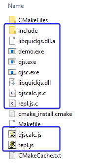

# quickjs_cmake
The cmake build system for [quickjs](https://github.com/bellard/quickjs), and a demo to explain how to use it. include js call C interface and class.

Especially, it support build quickjs on windows platform.

It support these features:
- [X] support quickjs shared library
- [X] support qjsc application
- [X] support qjs with repl.js and qjscalc.js
- [X] output quickjs headers to include 
- [X] output source: repl.js.c, qjscalc.js.c
- [X] output libquickjs.dll/so, qjsc, qjs
- [X] cmake auto setting quickjs VERSION to code

# demo features
- [ ] Run js code in C
- [ ] Run js code to use std, os module
- [ ] Call js function/code from C
- [ ] Extend js function/class using C
- [ ] js http fetch impletation
- [ ] js UI impletation

# Platform Support
- [X] Windows + Mingw-w64, test passed
- [ ] Linux + gcc, not tested, should pass
- [ ] Android + gcc, not tested, should pass

** Why not support MSVC/Clang? **
> Because quickjs use a lot of gcc features, headers and pthread library.  
> If we change it, it's a big change to source code, and can't trace the latest version.
> The original code is ok for mingw in Win32. 
> So build on windows platform with Mingw-W64-UCRT64 is the best way on it! 

# How to use with latest quickjs?

```bash
cd <dir>
git submodule update

# custom build dir and build with release version
mkdir build
cd build

# windows 
cmake .. -G "MinGW Makefiles" -DCMAKE_BUILD_TYPE=Release
mingw32-make


# linux
cmake .. -DCMAKE_BUILD_TYPE=Release
make 
```

logs
```bash
C:\MyCode\quickjs_cmake\build>cmake .. -G "MinGW Makefiles" -DCMAKE_BUILD_TYPE=Release
-- The C compiler identification is GNU 14.1.0
-- The CXX compiler identification is GNU 14.1.0
-- Detecting C compiler ABI info
-- Detecting C compiler ABI info - done
-- Check for working C compiler: C:/msys64/ucrt64/bin/cc.exe - skipped
-- Detecting C compile features
-- Detecting C compile features - done
-- Detecting CXX compiler ABI info
-- Detecting CXX compiler ABI info - done
-- Check for working CXX compiler: C:/msys64/ucrt64/bin/c++.exe - skipped
-- Detecting CXX compile features
-- Detecting CXX compile features - done
-- current used C compiler: C:/msys64/ucrt64/bin/cc.exe, CXX compiler: C:/msys64/ucrt64/bin/c++.exe.
-- >>> Begain quickjs library build >>>
-- quickjs version: [2024-02-14]
-- current dir: C:/MyCode/quickjs_cmake
-- QJS ./quickjs/cutils.c;./quickjs/libbf.c;./quickjs/libregexp.c;./quickjs/libunicode.c;./quickjs/quickjs-libc.c;./quickjs/quickjs.c;./quickjs/cutils.h;./quickjs/libbf.h;./quickjs/libregexp-opcode.h;./quickjs/libregexp.h;./quickjs/libunicode-table.h;./quickjs/libunicode.h;./quickjs/list.h;./quickjs/quickjs-atom.h;./quickjs/quickjs-libc.h;./quickjs/quickjs-opcode.h;./quickjs/quickjs.h
-- >>> Begain qjsc build >>>
-- QJSC_APP ./quickjs/qjsc.c
-- >>> Begain qjs (qjscalc, repl) build >>>
-- quickjs library and binary build finished.
-- >>> Begain demo app build >>>
-- DEMO_SRC demo.c;demo.h
-- Configuring done (16.5s)
-- Generating done (0.1s)
-- Build files have been written to: C:/MyCode/quickjs_cmake/build

C:\MyCode\quickjs_cmake\build>mingw32-make
[  6%] Building C object CMakeFiles/quickjs.dir/quickjs/cutils.c.obj
[ 12%] Building C object CMakeFiles/quickjs.dir/quickjs/libbf.c.obj
[ 18%] Building C object CMakeFiles/quickjs.dir/quickjs/libregexp.c.obj
[ 25%] Building C object CMakeFiles/quickjs.dir/quickjs/libunicode.c.obj
[ 31%] Building C object CMakeFiles/quickjs.dir/quickjs/quickjs-libc.c.obj
[ 37%] Building C object CMakeFiles/quickjs.dir/quickjs/quickjs.c.obj
[ 43%] Linking C shared library libquickjs.dll
[ 43%] Built target quickjs
[ 50%] Building C object CMakeFiles/qjsc.dir/quickjs/qjsc.c.obj
[ 56%] Linking C executable qjsc.exe
[ 56%] Built target qjsc
[ 62%] Generating repl.js.c, qjscalc.js.c
[ 68%] Building C object CMakeFiles/qjs.dir/quickjs/qjs.c.obj
[ 75%] Building C object CMakeFiles/qjs.dir/repl.js.c.obj
[ 81%] Building C object CMakeFiles/qjs.dir/qjscalc.js.c.obj
[ 87%] Linking C executable qjs.exe
[ 87%] Built target qjs
[ 93%] Building C object CMakeFiles/demo.dir/demo.c.obj
[100%] Linking C executable demo.exe
[100%] Built target demo

```

Demo


# Author
BBDXF @ 2024-07


